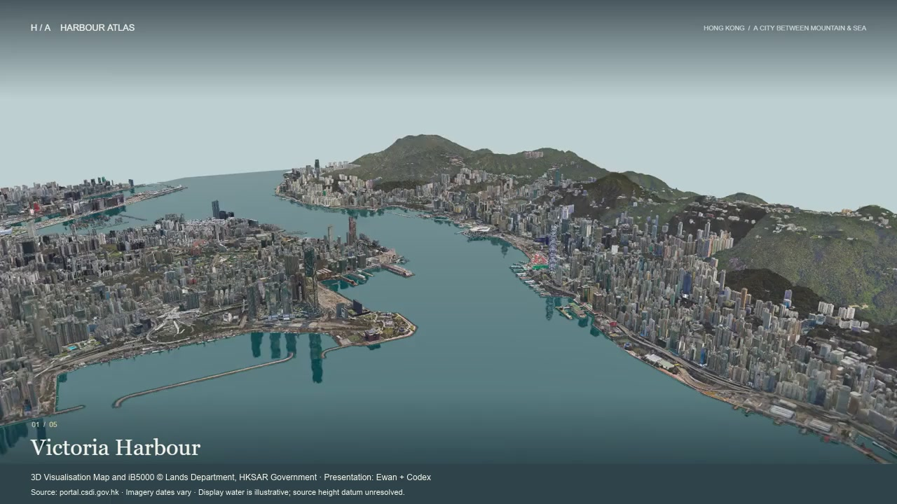
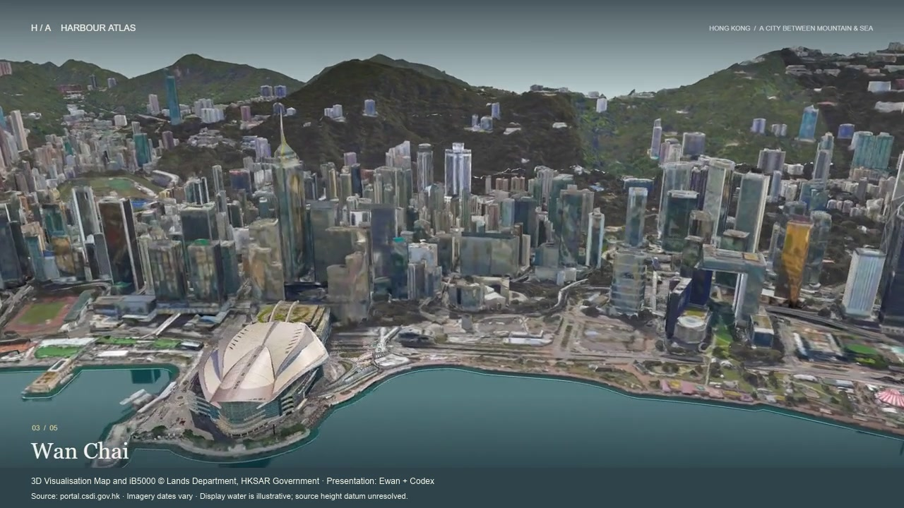

# Harbour Atlas

**Hong Kong's photographic city surface, with its provenance kept visible.**

[Watch the 60-second film](media/harbour.mp4)

The local study uses the Lands Department's official 3D Visualisation Map, retaining source texture coordinates and photographic appearance. Its source collection contains 2,302 tiles; the presentation uses 2,197 tiles and 2,240 original texture images. Detailed landmark regions are distinguished from coarser context.

## Presentation choices with explicit limits

An official mapped-water derivative provides a continuous display surface while raw-source mode retains the original photographic water. The selected water height is a rendering parameter, not a measured tide.

The photographic source's vertical datum could not be established. The known HKPD terrain reference is therefore displayed separately, without claiming an unverified common height datum. Mixed revision dates also do not establish the capture date of each photograph or a present-day survey.

The final local browser views, source picking and display modes were inspected. A portable copy of the Rhino model visibly loaded its adjacent textures. The film comes from an actual 1,440-frame browser capture, with complete decode and selected-frame visual review. Texture seams, reconstruction roughness and different levels of detail remain visible.

**Attribution:** 3D Visualisation Map and iB5000 © Lands Department, HKSAR Government. Source: portal.csdi.gov.hk. Reprojection and presentation adapted for Harbour Atlas. Government ownership and source reuse terms remain; no endorsement is implied.

**Contribution:** project direction and resources by Ewan; acquisition tooling, implementation, checks and rendering by Codex with user direction. Only images and the compact film are published here; city tiles, texture datasets, CAD files and terrain payloads are excluded.

[Sources and reuse notes](CREDITS.md#harbour-data) · [Portfolio](README.md) · [Profile](../README.md)
