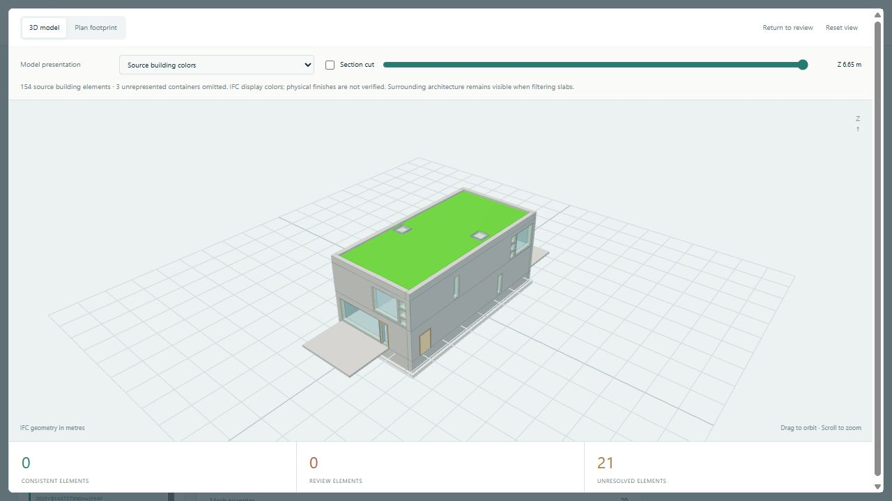
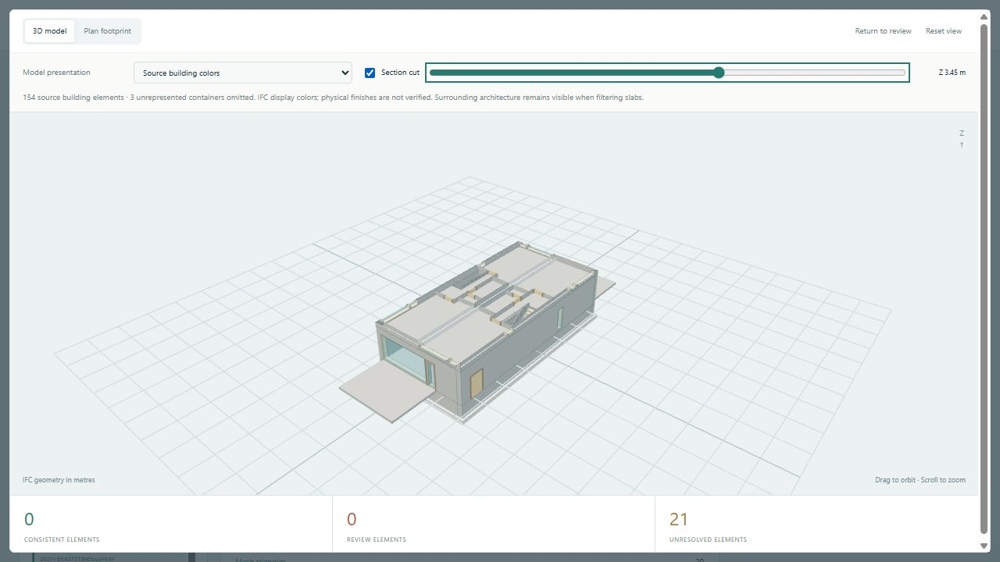

# Void-Aware IFC Review

**A quantity-review prototype that keeps missing evidence unresolved.**

The prototype asks whether a slab's declared NetArea can be supported by its geometry and quantity units. It subtracts openings, resolves quantity units separately from geometric coordinates, and retains element-level evidence. Missing quantities, ambiguous scope or unsupported geometry do not become an automatic pass.

The public Duplex case retains **154 displayed building elements** from the same source IFC, rather than replacing the building with a decorative model. **21 slab comparisons remain unresolved** because declared quantity evidence is missing. Summing every slab layer would not establish building gross floor area.

## Evidence retained locally

- 14 analytical IFC fixtures, 45 Python engine tests and 5 display tests.
- A reproduced and repaired area-unit conversion failure.
- Source identity checks and 11 saved reports bound to their input, request and engine.
- A reusable Codex project skill and an independently recorded skill-use trial.

The displayed section clips the original context; it does not modify the IFC or the area-review result. Source display colors are retained, but they do not verify physical finishes. The software, fixtures and models remain local in this presentation-only edition.

**Contribution:** Ewan supplied the application direction and domain context. Codex implemented and verified the new prototype with that direction. The Duplex architecture is an external test model, not my architectural design.

**Source:** BSI (2020), “Duplex Apartment Test Files,” buildingSMART International, CC BY 4.0. Screenshots are derived interface views. [Full attribution](CREDITS.md#ifc-reference).

[Portfolio](README.md) · [Profile](../README.md)
