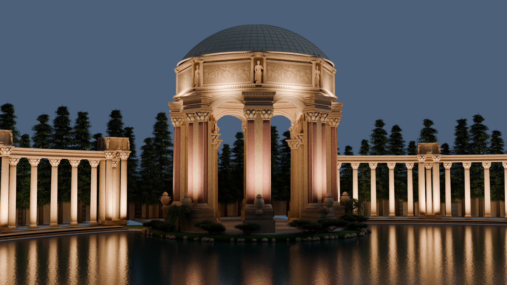
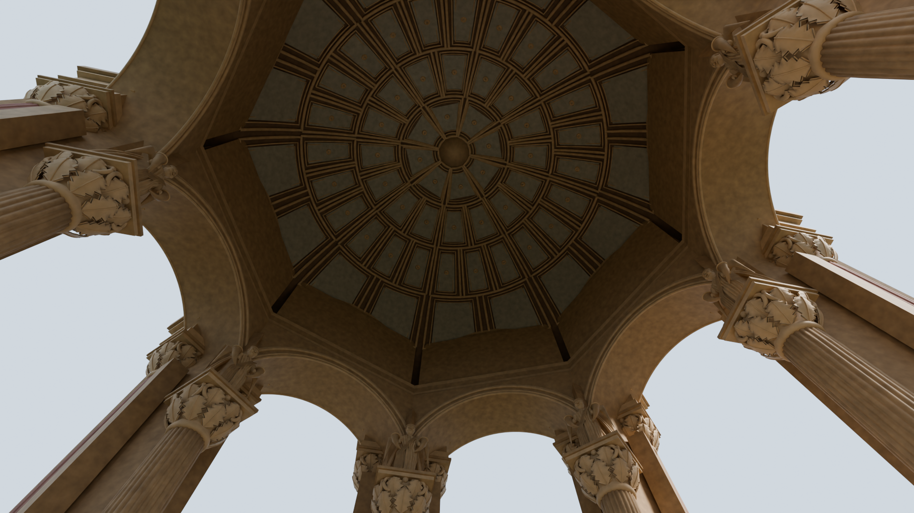

# Palace of Fine Arts

**A reference-led architectural reconstruction study.**

[Watch the 36-second film](media/palace.mp4)

Historical sources guided the rotunda's scale, eight triangular piers, paired exterior columns and curved colonnades. The 162-foot height is measured from the modeled rotunda floor to the dome apex. That source dimension is distinguished from estimated local proportions and site geometry.

The refinement corrected the floor-height datum, column arrangement, paired roof urns, attic niches, arch openings and lagoon relationships. Daylight views complement the evening film so that materials and proportions can be inspected.

## Inspect, correct, document

The local workflow combines a procedural Blender scene, rendered comparisons and a geometry inspector. Browser checks led to corrections in column shading and the treatment of subpixel roof joints. All final film frames decoded successfully; selected encoded images and shot endpoints were visually inspected. These checks establish the tested output's consistency, not survey accuracy.

The ornament, allegorical figures, vegetation and parts of the site are interpretive. An original generated relief texture does not reproduce measured sculpture depth. This is an AI-assisted visualization study, not a surveyed replica or a live autonomous agent.

**Contribution:** project brief and direction by Ewan; research, implementation and rendering by Codex with user direction. The public page contains original project renders and the compact film, without Blender, Rhino or browser model files.

[Reference sources](CREDITS.md#palace-references) · [Portfolio](README.md) · [Profile](../README.md)
