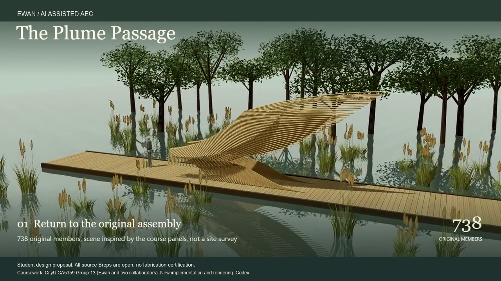
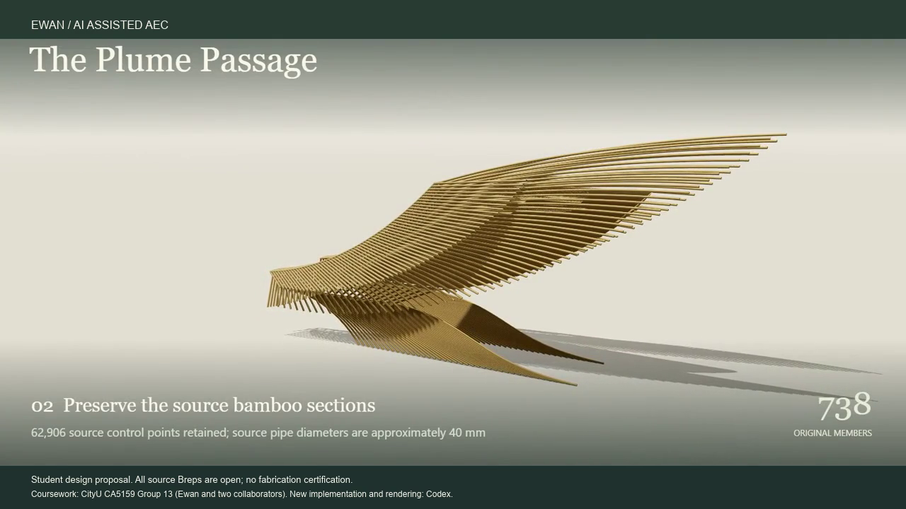

# The Plume Passage / Plume Agent

**Preserve the original assembly before evaluating a new constraint.**

[Watch the 24-second film](media/plume.mp4)

The original CityU CA5159 group proposal is credited to **Ewan and two collaborators (CityU CA5159 Group 13)**. My coursework responsibility was **Grasshopper component-network assembly**. The later Codex-assisted extension adds inspection, source-linked reporting and a recorded review workflow.

## What the review preserves

The local source edition retains **738 original Rhino surface members** and their identities. All 62,906 audited surface and edge control points match after the documented rigid recentering. The display uses the source's trimmed surface meshes rather than sampling the untrimmed underlying surfaces.

The source Breps remain open. No invented end caps, construction connections or structural performance are claimed.

## A useful failed assumption

A historical affine widening clears an added illustrative passage target, but it also distorts bamboo sections to a measured diameter ratio of approximately **1.651:1**. Zero mesh interference is therefore not proof of a buildable solution. The original assembly is the primary design; the widened version is explicitly an experiment.

Input-validation repairs reject empty or invalid models before design checks. The local project retains 20 JavaScript and 8 Python tests and records the report-to-CAD identity correction.

The wetland setting follows the course panels' visual language; it is not a surveyed site. New implementation, automated checks and rendering were performed by Codex with user direction. Model and geometry files are omitted from this public edition.

[Credits](CREDITS.md#plume-coursework) · [Portfolio](README.md) · [Profile](../README.md)
